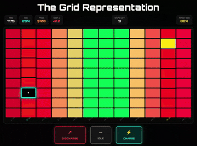

# ChargeTrek: Visual Reinforcement Learning for EV Charging in V2G Systems


ChargeTrek is a visual reinforcement learning (Visual RL) framework that turns electric vehicle (EV) charging/discharging into an Atari‑style decision‑making problem. Instead of feeding the agent numerical tables or hand‑crafted features, ChargeTrek encodes electricity price signals, forecast errors, and battery dynamics directly into RGBA images. A convolutional neural network (CNN) then learns to navigate this visual world, deciding when to charge, discharge, or stay idle.

The project targets vehicle‑to‑grid (V2G) scenarios and is built to be:

- **Interpretable** – you can literally see what the agent sees.  
- **Robust** – works under real‑world price uncertainty.  
- **Safe** – hard constraints on battery state‑of‑charge are always respected.  

---

## Table of Contents
- What Problem Does ChargeTrek Solve?
- Key Features
- Environment Design (The “Game”)
- Supported Algorithms & Baselines
- Installation
- Quick Start
- Playing with a Trained Agent
- Training Your Own Agent
- Project Structure
- Data Source
- Performance Highlights
- Deployment Perspective
- Citation
- License
- Contributing

---

## What Problem Does ChargeTrek Solve?

Electricity prices are volatile, and forecasts are never perfect. An EV owner (or fleet operator) wants to:

- Minimise charging costs.  
- Sell energy back to the grid (V2G) when prices are high.  
- Guarantee a desired battery level by the next departure.  

Traditional approaches use linear programming or model‑predictive control, which rely on accurate forecasts and are often opaque. ChargeTrek takes a different route: it teaches an AI agent to see the problem and learn a policy directly from pixels, much like DeepMind’s DQN plays Atari games.

---

## Key Features

- **Visual RL Environment** – A custom gymnasium environment that renders the charging task as a 2D grid image.  
- **Three Action Modes** – Charge (+), Discharge (–), Idle (→).  

### Multiple Training Strategies
- **C51 (Distributional DQN)** – pure RL with a categorical value distribution.  
- **DAgger (Dataset Aggregation)** – imitation learning mixing expert demonstrations with agent experience.  
- **IB‑C51** – C51 initialised with expert trajectories.  

- **Safety Guarantee** – Bellman‑Ford‑based fallback planner ensures no SoC violations.  
- **Real‑World Data** – Uses CAISO electricity prices.  
- **Scalable Training** – LMDB replay buffers for large-scale experience storage.  
- **Interactive Visualisation** – Real-time grid rendering with matplotlib.  

---

## Environment Design (The “Game”)

- **X-axis** → Time (24h, 15‑min resolution → 96 steps)  
- **Y-axis** → State of Charge (0–100%, 101 levels)  

Each RGBA pixel encodes:

| Channel | Meaning |
|--------|--------|
| R | Electricity price (red = expensive) |
| G | Cheapness (green = cheap) |
| B | Forecast error sign |
| A | Uncertainty magnitude |

### Demonstration


<p align="center">
  
</p>

<p align="center"><em>Figure: ChargeTrek Demonstration</em></p>

---

## Supported Algorithms & Baselines

| Method | Description |
|------|-------------|
| C51 | Distributional DQN |
| DAgger‑DQN | Imitation learning |
| IB‑C51 | Hybrid approach |
| Immediate Charger | Naïve baseline |
| Stepwise Planner | Short-term optimisation |
| Optimal (Oracle) | Bellman‑Ford optimal |

---

## Installation

```bash
git clone https://github.com/houaleframzi/ChargeTrek.git
cd ChargeTrek
python3.10 -m venv venv
source venv/bin/activate
pip install -r requirements.txt
```

---

## Quick Start

```bash
python play_chargtrek.py
```

Controls:
- 0 – Charge  
- 1 – Discharge  
- 2 – Idle  
- m – Next Step of the Selected Strategy

---

## Training

```bash
python train_c51.py
python train_dagger.py
python train_IB_c51.py
```

---

## Project Structure

```
ChargeTrek/
├── agents/                 # RL agent implementations
│   ├── c51_agent.py        # C51 (distributional DQN)
│   ├── dagger_dqn_agent.py # DAgger
│
├── envs/                   # Gymnasium environment
│   └── chargetrek_env.py   # Main environment (grid, rewards, transitions)
│
├── utils/                  # Helper modules
│   ├── price_loader.py     # Load & preprocess CAISO data, create RGBA grid
│   ├── soc_mapper.py       # SoC ↔ grid‑row conversion
│   ├── disk_replay_buffer.py  # LMDB‑backed replay buffer
│   └── charge_trek_multigraph.py  # Graph builder for Bellman‑Ford
│
├── benchmarks/             # Baseline solvers
│   ├── magic_solver.py     # Optimal (Bellman‑Ford) path
│   └── realistic_solver.py # Stepwise replanning
│
├── data/                   # CAISO electricity price CSV files
├── buffers/                # LMDB replay buffers (created during training)
├── checkpoints/            # Saved model weights
├── logs/                   # Training logs (CSV)
│
├── play_chargtrek.py       # Interactive visualisation script
├── train_c51.py            # Training script for C51
├── train_dagger.py         # Training script for DAgger‑DQN
├── train_IB_c51.py         # Training script for IB‑C51
├── requirements.txt        # Python dependencies
└── README.md
```

---

## Data Source

CAISO electricity market data (day‑ahead + real‑time).

---

## Performance Highlights

- Up to **34% cost reduction** vs naive charging  
- DAgger approaches near-optimal performance  
- Interpretable CNN decisions  

---

## Deployment Perspective

- Lightweight inference (CNN forward pass)  
- OTA policy updates  
- Safe fallback via graph planning  

---

## Citation

```bibtex
@article{HOUALEF2026127853,
title = {ChargeTrek: A gamified visual learning framework for EV charging in V2G systems},
journal = {Applied Energy},
volume = {414},
pages = {127853},
year = {2026},
issn = {0306-2619},
doi = {https://doi.org/10.1016/j.apenergy.2026.127853},
url = {https://www.sciencedirect.com/science/article/pii/S0306261926005052},
author = {Ahmed-Ramzi Houalef and Jorge E. Mendoza and Florian Delavernhe and Sidi-Mohammed Senouci},
keywords = {Electric vehicles, Vehicle-to-grid, Smart grid, Reinforcement learning, Gamification, Charging optimization, Imitation learning, Dynamic optimization, Scheduling;Visual reinforcement learning, AI},
abstract = {The rapid rise of electric vehicles (EVs) and their integration into power systems through vehicle-to-grid technologies have created unprecedented opportunities for intelligent energy management. EVs can not only charge during off-peak hours but also discharge stored energy back to the grid during periods of high demand—an interaction traditionally modeled as a static optimization problem. In reality, however, EV charging behavior is inherently dynamic: fluctuating electricity prices, uncertain user mobility, and varying grid conditions transform this task into a complex, time-dependent optimization challenge. Conventional optimization approaches often struggle to adapt to such nonstationary and uncertain environments. In contrast, reinforcement learning and imitation learning have shown exceptional abilities to handle dynamic decision-making, particularly in domains such as Atari video games, where agents learn optimal strategies through continuous interaction and feedback. Inspired by this, we introduce ChargeTrek—a novel, gamified environment that reimagines EV charging as an Atari-style video game. By translating the problem into a visual, interactive, and interpretable framework, ChargeTrek bridges the gap between abstract optimization and interpretable decision-making. Within this environment, an autonomous agent learns when to charge, discharge, or remain idle by leveraging real-time electricity price signals while respecting user mobility constraints. Computational experimentation demonstrates that ChargeTrek can reduce charging costs by up to 34% compared to typical human charging behavior.}
}
```

---

## License

MIT License

---

⚡ Happy charging!


